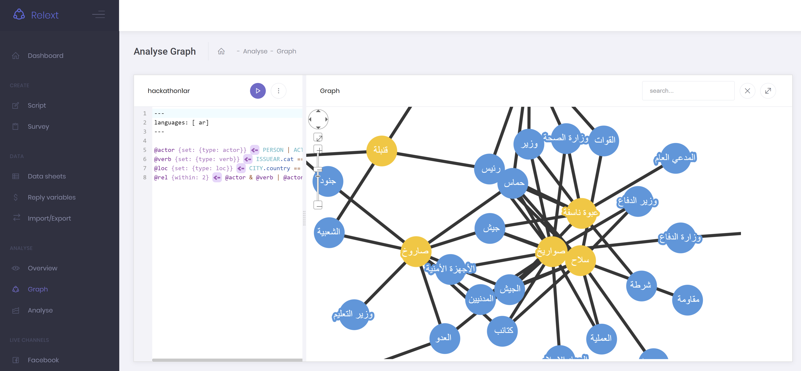
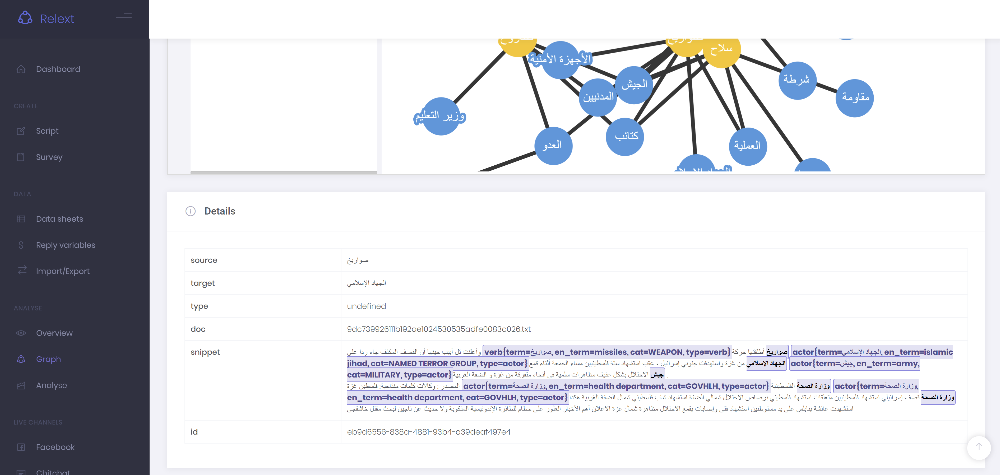

# Relext - relation extraction application #

## Background

- Event: [Hackathon For Peace, Justice and Society](https://www.hackathonforgood.org)
- Challenge: [ICC Relation Extraction](https://www.hackathonforgood.org/icc)
- Team: Peace Informatics Lab (Team 7)
- Members: Arvid Halma, Aaron Swaving, Boaz Manger, Jasper Ginn
- Contact: ahalma[at]gmail.com

This repository contains all files needed to set up our entry for the Hackathon for Peace, Justice and Society. Specific instructions are given below.

Our project is based on the [ChitChat chatbot](https://bitbucket.org/arvid/chitchat/src/master/) developed at the [Leiden University Center for Innovation](https://www.centre4innovation.org/).

## Project and challenge details

From: https://www.hackathonforgood.org/icc

*As part of the evidence gathering and analysis process, the Office of the Prosecutor (OTP) of the International Criminal Court has to analyse a number of written documents. These documents span a variety of formats – txt, pdf, htm(l), doc(x), xls(x) etc. – and come from a variety of sources: NGO reports, news articles, witness statements etc. All these documents are analysed as they contain information regarding specific events that have taken place. Valuable information from these accounts is extracted and captured as entities (nodes) and relationships (edges) in a graph database - internally referred to as the Factual Analysis Database (FAD). Types of entities include persons, locations, organisations, events, dates etc. Relationships or links describe how entities interact with each other. The collected data is then analysed using domain specific software - such as IBM’s i2 and Analyst Notebook. Currently entities and relationships are for the most part manually extracted from the documents. This is a time consuming process and the OTP would greatly benefit from automation in the entities and relationships extraction process as more efforts could be focused on other phases of the analysis. The extraction process can be broken down into two sub-processes: Entities Extraction (which essentially is Named Entities Recognition) and Relationship Extraction. Currently the market offers a number of tools – both proprietary and open source – which allow for conducting Named Entities Recognition with a relatively high accuracy. However, the Relationship Extraction part of the process is more challenging and there seems to be an absence of relevant solutions. Therefore, the OTP would like the hackathon participants to focus on the Relationship Extraction part specifically.*

## Our solution

**Relext** allows investigators to extract relations between actors, locations and actions from any kind of textual source. Our philosophy places the individual investigator squarely at the center of the analysis.

The core features of Relext are:

1. Production-ready code based on the thoroughly tested [ChitChat framework](https://bitbucket.org/arvid/chitchat/src/master/)
2. Delivered with pre-loaded political [event data dictionaries](https://github.com/openeventdata/PLOVER) 
3. Users can add their own actors, actions and locations using a straightforward scripting interface or by defining their own data sheets.
4. Powerful, expressive and human-centered scripting language allows the user to define complex rules, patterns and associations
5. Uses state-of-the-art NLP libraries. 
6. Interpretable, transparent visualizations that help the user drill down from the top-level overview to individual events.
7. Support for multiple languages 


## Screenshots ##

Demo of Arabic support:






## Technical Requirements ##

The Relext service is written in the Java programming language and can therefore be hosted on Linux or Windows servers. It has an embedded webserver, so it can run as a standalone.
The Relext server requires an active PostgreSQL 10 database, Java 8 and the following minimal system requirements:
2 CPU cores
2 GB RAM
10 GB Disk space

Supporting software, found in the 'support' folder, consists of a python 3 script to download news articles from the free [www.webhose.io](https://webhose.io/) API. This script depends on Python 3, as well as the [webhoseio](https://pypi.org/project/webhoseio/), [datetime](https://pypi.org/project/DateTime/) and [pandas](https://pypi.org/project/pandas/) modules

## Installation ##

### PostgreSQL ###

The code below installs postgresql 10 on linux systems and creates the relevant database, user and extensions.
```
sudo apt-get install postgresql-10

sudo -u postgres psql -p 5432

CREATE USER relext WITH PASSWORD 'secret';
CREATE DATABASE relext OWNER relext;
\connect relext
CREATE EXTENSION "uuid-ossp";
CREATE EXTENSION pgcrypto;
```

The database can then be set up by passing the following arguments to Relext, either in IntelliJ or as arguments to the .jar file.

```
db migrate settings.yml
db drop-all --confirm-delete-everything settings.yml
```
The latter drops the database whereas the first one sets it up.


## Running the Application ##

Download or build the .jar file. The service can then be ran using:
```
java -jar relext-x.y.z.jar server settings.yml
```

By default the service will run in an interactive shell.